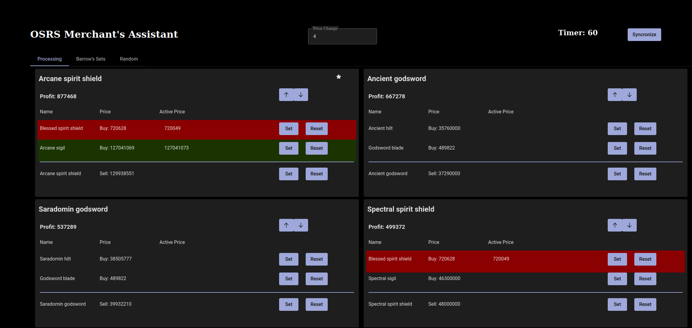

This is a [Next.js](https://nextjs.org/) project bootstrapped with [`create-next-app`](https://github.com/vercel/next.js/tree/canary/packages/create-next-app).

## Getting Started

First, install required packages:

```bash
npm install
```
Then, run the application: 

```bash
npm run dev
```

Open [http://localhost:4004](http://localhost:4004). Add a user agent like "Garrick's Market App" and your email. This is collected by the API service.



Syncronize is used to make the timing of updates match other UI's/Runelite plugins.
Setting a price will make it easier to see when you need to update values in the Grand Exchange.
The arrows add priority to keep specific recipes at the top or bottom.
